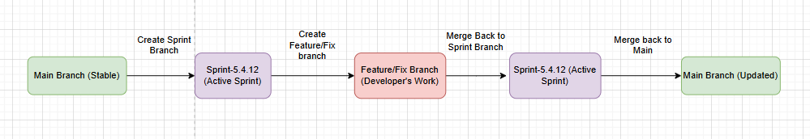
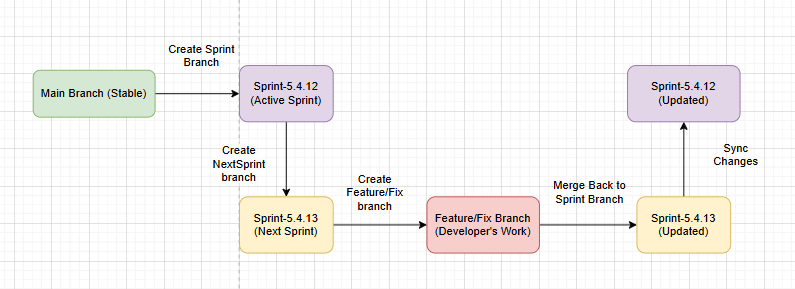
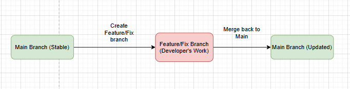
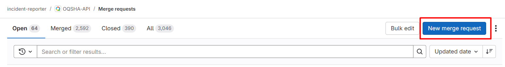
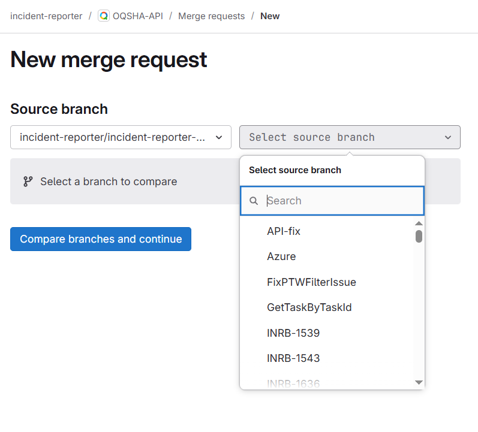
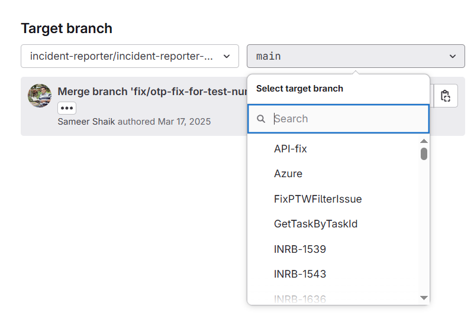
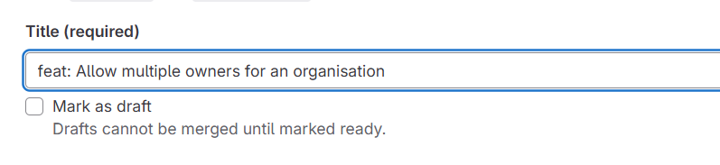
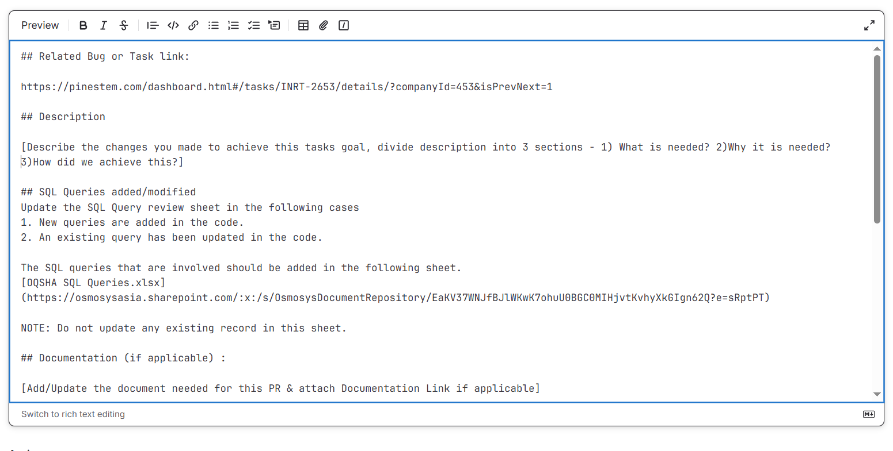
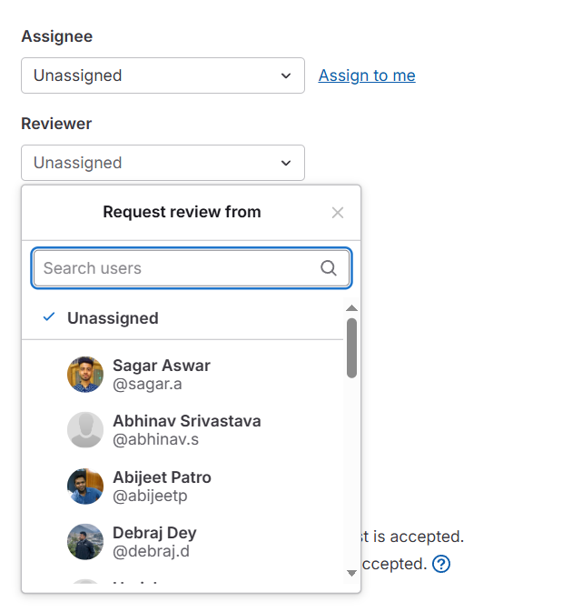
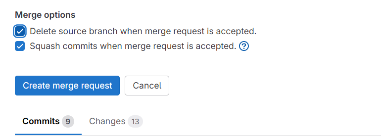

# Contributing to OQSHA

Thank you for your interest in contributing to the OQSHA API project! This document outlines the guidelines for contributing to this repository.

## Table of Contents
- [Getting Started](#getting-started)
- [Branching and Workflow](#branching-and-workflow)
  - [Branching Model at OQSHA](#branching-model-at-oqsha)
- [Coding Guidelines](#coding-guidelines)
- [Submission Guidelines](#submission-guidelines)
  - [Creating & Submitting a Merge Request (MR)](#creating--submitting-a-merge-request-mr)
- [Commit Message Guidelines](#commit-message-guidelines)
  - [Commit Message Format](#commit-message-format)
  - [Reverting a Commit](#reverting-a-commit)
  - [Commit Types](#commit-types)
- [Testing](#testing)
- [Code Review](#code-review)

## Getting Started

### Clone the Repository

```sh
git clone http://gitlab.osmosys.co/incident-reporter/incident-reporter-api.git
```

## Branching and Workflow

### Branching Model at OQSHA

- OQSHA follows a structured branching model to support sprint-based development and handle parallel sprints or urgent production changes.

- **Sprint-Based Development Process**  
  - Development follows a sprint-based workflow, where each sprint has a dedicated branch.  
  - Example: If Sprint `5.4.12` is in progress, a branch `Sprint-5.4.12` is created from the `main` branch.  
  - Developers create their feature/fix branches from the active sprint branch (`Sprint-5.4.12`).  
  - Once all contributions are complete, `Sprint-5.4.12` is merged back into `main`.  



- **Handling Multiple Simultaneous Sprints**  
  - In cases where two sprints run concurrently (e.g., `Sprint-5.4.12` and `Sprint-5.4.13`), a structured branching strategy is followed.  
  - The first sprint (`Sprint-5.4.12`) is created from the `main` branch.  
  - The second sprint (`Sprint-5.4.13`) is created from `Sprint-5.4.12`, instead of `main`.  
  - As developers push changes to `Sprint-5.4.12`, these updates must be **regularly synced** into `Sprint-5.4.13` to ensure consistency.  
  - This prevents conflicts and ensures that `Sprint-5.4.13` includes the latest updates from `Sprint-5.4.12`.  




- **Synchronization Strategy**  
  - Developers working on `Sprint-5.4.13` must periodically pull the latest changes from `Sprint-5.4.12`.  
  - This can be done using rebasing or merging, ensuring the branch stays updated.  
  - When `Sprint-5.4.12` is finally merged into `main`, the latest version of `Sprint-5.4.13` will already contain all necessary updates, simplifying the final integration.

- **Hotfixes/Production Bug Fixes**
  - If there is a change required or a bug is found in production, a new branch is created from `main` to address the issue.
  - Fixes are made directly on this branch.
  - Once the issue is resolved and tested, the branch is merged back into `main`.
  - If needed, these changes can later be merged into the active sprint branches.



- **Workflow**
  - For sprint-based development, use the relevant sprint branch to create branches for development work (e.g. `Sprint-5.4.12`).
  - Use the `main` branch for stable releases or production changes.

## Coding Guidelines

- Follow standard C# naming conventions. (Follow Coding Standards)
- Keep methods and classes modular and reusable.
- Use proper logging and error handling.
- Write XML documentation comments where necessary.
- Adhere to the repository structure:
  - `IncidentReporter.API` for controllers and business logic.
  - `IncidentReporter.DAL` for database operations.
  - `IncidentReporter.NotificationSender` for notifications.
  - `IncidentReporter.RenewalReminder` for scheduled tasks.

- Follow this link to access [Coding Standards][coding_stds] at Osmosys.

## Submission Guidelines

### Creating & Submitting a Merge Request (MR)

Before you submit your Merge Request (MR), consider the following guidelines:

1. Search [GitLab Merge Requests][gl_mrs] for an open or a closed Merge Request to avoid duplicate efforts.
2. Clone this repository.
3. Create a new git branch following the appropriate naming conventions:
   
   - **New feature:**  
     ```sh
     git checkout -b feat/add-user <target-branch-name>
     ```
   - **Bug fix:**  
     ```sh
     git checkout -b fix/sorting-tickets <target-branch-name>
     ```
   - **Document changes:**  
     ```sh
     git checkout -b docs/update-readme <target-branch-name>
     ```
4. Make changes and include appropriate test cases.
5. Format your files properly.
6. Run test cases and ensure all tests pass.
7. Commit your changes using a descriptive commit message following our [commit message conventions](#commit-message-guidelines).
   
   ```sh
   git commit -a
   ```
8. Keep your branch up-to-date by rebasing or merging from the latest sprint branch (e.g., `Sprint-5.4.12`).
9. Push your branch to GitLab:
   
   ```sh
   git push origin <branch-name>
   ```
   
10. Navigate to the repository in GitLab.
11. Click on Merge Requests in the left sidebar.
12. Click New Merge Request.

13. Select your source branch (e.g., feat/add-user).

14. Select the target branch (Sprint-5.4.12 or another sprint branch).

15. Fill in the Merge Request title:

16. Ensure proper description with relevant details.

16. Assign the Merge Request to yourself & Request for Code Review from a Reviewer.

17. Check the Checkboxes: Squash Commits & Delete source branch after merge. 

18. Verify all the changes & Click Create Merge Request.
19. Wait for code review and address any requested changes.

- Make the required updates & push the code to gitlab branch.
- Re-run test cases to ensure all tests pass.
- Rebase your branch (if needed) and force push to update your Merge Request.

## Commit Message Guidelines

### Commit Message Format

Each commit message consists of a **header**, an optional **body**, and an optional **footer**:

```
<type>: <subject>

<body>

<footer>
```

- The **header** is mandatory & must be in all lowercase.
- The **body** & **footer** can have both uppercase & lowercase letters.
- Each line should be under 100 characters.

#### Examples

```
docs: update api response sheet
fix: modify permissions for user
```

```
feat: update auth token generation in helper class

Updated the Implementation of JWT token generation in the JWTHelper class, including role-based claims.
Updated token expiration and signing key handling for better security.

Closes #123
```

### Reverting a Commit

If reverting a commit, use the following format:

```
revert: <header of reverted commit>

This reverts commit <hash>.
```

### Commit Types

- **build**: Changes to the build system or dependencies
- **chore**: Non-production code updates
- **ci**: Continuous Integration changes
- **docs**: Documentation updates
- **feat**: New features
- **fix**: Bug fixes
- **perf**: Performance improvements
- **refactor**: Code restructuring without changing behavior
- **style**: Formatting changes (whitespace, semi-colons, etc.)
- **test**: Adding or modifying tests
- **sample**: Sample code changes

### Commit Subject

- Use the imperative, present tense ("change" not "changed").
- Do not end with a period (`.`).

### Commit Body

- Use the imperative, present tense.
- Explain the reason for the change and its impact.

### Commit Footer

- Use for breaking changes (`BREAKING CHANGE:`) and issue references (`Closes #123`).

### Merge Request Title Format

```
docs: add request response document 
```

```
fix: fix ticket sorting bug 
```

```
feat: allow multiple owners for an organisation 
```

## Testing

- Write unit tests for all new features and bug fixes.
- Run tests locally before submitting a Merge Request.
- Ensure compatibility with `.NET Framework 4.5.2`.
- Use local databases for DAL testing.

## Code Review

- Code reviews are mandatory before merging into the sprint or `main` branch.
- Ensure:
  - Code follows best practices and is well-documented.
  - Changes do not break existing functionality.
  - All test cases pass.
- Leave comments for improvements where necessary.

Thank you for contributing to the OQSHA API! Your efforts help improve the project for everyone.

[commit-message-format]: https://docs.google.com/document/d/1QrDFcIiPjSLDn3EL15IJygNPiHORgU1_OOAqWjiDU5Y/edit#
[gl_mrs]: https://gitlab.osmosys.co/incident-reporter/incident-reporter-api/-/merge_requests
[coding_stds]: https://github.com/OsmosysSoftware/dev-standards/blob/main/coding-standards/dotnet.md
